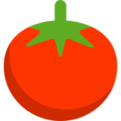

# LandPage React
## Project description

 
🔥 This code was created to exemplify the use of neutralinojs in the article written by myself on dev.to  

| Website | Author | Post |
| :--: | :-- |:--: |
|  | Carlos Alves | [Neutralinojs - Alternativa para o Electron](https://dev.to/eucarlos/neutralinojs-alternativa-para-o-electron-41g4) |

___
### Installation

Clone the repo:

    git clone https://github.com/EuCarlos/neu-to-devto.git && cd neu-to-devto

___

Created with heart 💜 by <a href="https://github.com/eucarlos/">Carlos Alves</a>

