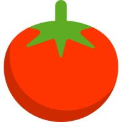

# LandPage React
## Artigo sobre Neutralino no dev.to

<p align="center">
<br>
🔥 Este código foi criado para exemplificar o uso de neutralinojs no artigo escrito por mim no dev.to <br>


</p>
<hr>

<p align="center">

</p>


| Site | Autor | Tipo | Nome da Postagem |
| :-----: | :----: | :--: |:---- |
|  | Carlos Alves | Artigo | [Neutralinojs - Alternativa para o Electron](https://dev.to/eucarlos/neutralinojs-alternativa-para-o-electron-41g4) |

___
### Instalação
Instale o Neutralinojs:

    $ npm i -g @neutralinojs/neu

Clone o repositório:

    $ git clone https://github.com/EuCarlos/neu-to-devto.git && cd neu-to-devto

### Rodar o projeto

Inicie o projeto:

    $ neu run

_Builde_ o projeto:

    $ neu build

### Imagem do projeto
<p align="center"></p>

### Executáveis
nos arquivos compactados em `executable.zip` contém 3 arquivos:
- pomodoro-win_x64.exe: É para rodar no Windows.
- pomodoro-linux_x64: É para rodar no linux.
- pomodoro-mac_x64: É para rodar no Mac OS.

### Estrutura de diretórios
```
.
├── .tmp
│    └──  auth_info.json
├── bin
│    ├── neutralino-linux_x64
│    ├── neutralino-mac_x64
│    └── neutralino-win_x64.exe
├── resources
│        ├── icons
│        ├── js
│        ├── index.html
│        └── styles.css
├── LICENSE
├── neutralino.log
└── README.md

```
___
<p align="center">
Criado com 💜 por <a href="https://github.com/eucarlos/">Carlos Alves</a>
</p>